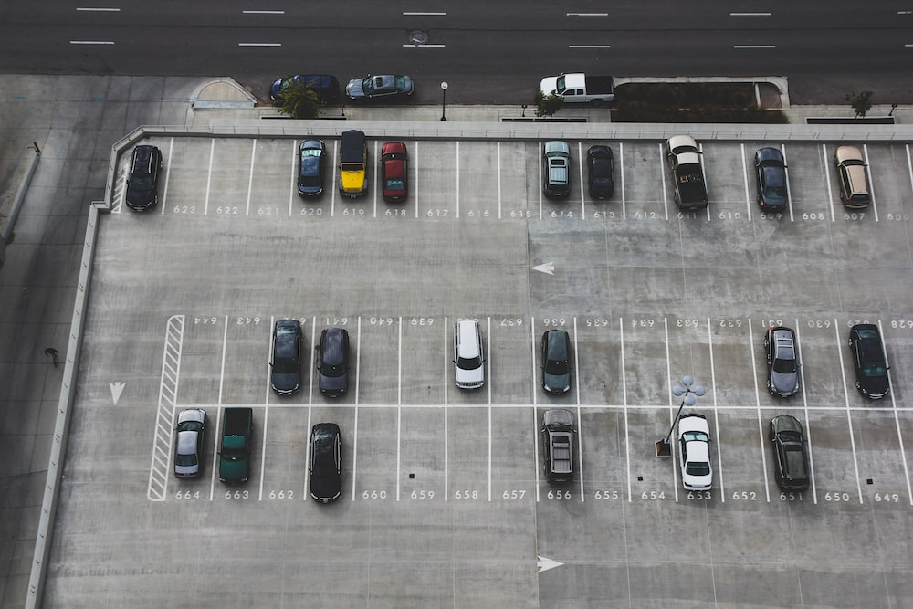

# parking_occupancy
Detecting parking lot occupancy from images is an important task that finds applications in various domains such as
smart parking systems and traffic management. There are multiple approaches available to tackle this problem, two of
which are using OpenCV with color shades and employing YOLOv8 object detection.



### Park positions configuration file
The configuration file, configuration.py, plays a crucial role in parking lot occupancy detection. This file contains the pixel coordinates of the parking lot spots and provides a convenient way to manage and organize the spatial information of the parking lot.
Run the configuraitn file using this command:

```python
python configuration.py -i "assets/new_park.png"
```
Use the mouse to select the parking lot spots. The pixel coordinates of the parking lot spots will be saved in the assets/park_positions file.


### Approach 1: Using YOLOv8 Object Detection
One approach to detect parking lot occupancy is by leveraging deep learning and object detection techniques, specifically using the YOLOv8 model. YOLO (You Only Look Once) is a state-of-the-art object detection algorithm that can identify and localize objects in images. By training the YOLOv8 model on a labeled parking lot dataset, the model can learn to detect and classify different types of vehicles and other objects present in the parking lot. The trained model can then be used to analyze images and predict the occupancy status of parking spaces. This approach offers a more sophisticated and accurate solution, capable of detecting a wide range of objects beyond just vehicles.

```python
python detect.py
```


### Approach 2: Using OpenCV and Color Shades
Another approach to detect parking lot occupancy is by utilizing OpenCV, a popular computer vision library, along with color shade analysis. This method involves segmenting the image based on predefined color thresholds for empty and occupied parking spaces. By setting appropriate color ranges and using image processing techniques like thresholding and contour detection, the algorithm can identify the occupied and vacant spaces in the parking lot. This approach offers a relatively simple and efficient solution for parking lot occupancy detection, especially when the color shades of the empty and occupied spaces have distinct differences.

```python
python cv_approach.py
```


Both approaches have their advantages and considerations. The OpenCV-based color shade analysis approach is relatively simpler to implement and can work well in scenarios where the color shades of empty and occupied spaces are distinct. On the other hand, the YOLOv8 object detection approach provides more robustness and flexibility in detecting various objects in the parking lot, but it requires training a deep learning model and can be computationally demanding.
